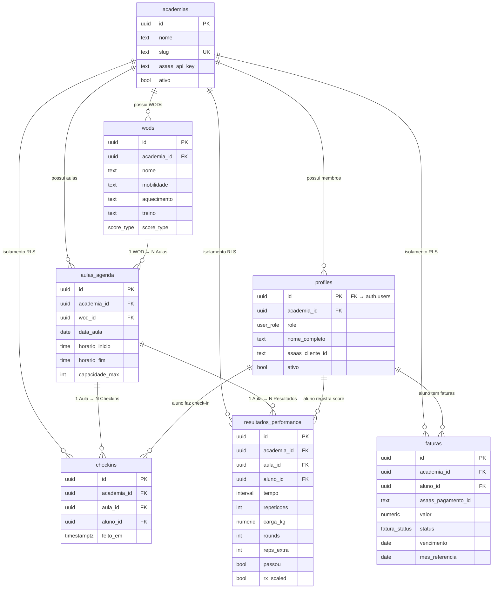

# UNAFIT — Diagrama de Relacionamento de Tabelas

## Diagrama ER (Mermaid)



## Leitura dos fluxos principais

### Fluxo: Treino do dia
```
academias
  └── wods           (conteúdo: Fran, Murph, etc.)
        └── aulas_agenda   (evento: 19h de 09/04/2026 faz "Fran")
              ├── checkins          (aluno X compareceu)
              └── resultados_performance  (aluno X fez em 8:32, RX)
```

### Fluxo: Trava financeira
```
profiles (aluno)
  └── faturas
        ├── status='paga'     → CHECK-IN PERMITIDO
        ├── status='pendente' → CHECK-IN BLOQUEADO (trigger + app)
        └── status='vencida'  → CHECK-IN BLOQUEADO (trigger + app)
```

### Fluxo: Ranking de um WOD
```
wods ──→ aulas_agenda ──→ resultados_performance ──→ profiles
              (data/hora)        (score RX/Scaled)      (nome do aluno)
```
> View `ranking_geral` materializa este JOIN automaticamente.

## Regras de isolamento (Multitenancy)

Toda tabela (exceto `academias`) tem `academia_id` como FK + índice.
As políticas RLS garantem que cada query retorna **apenas dados da academia do usuário autenticado**.
O `saas_admin` tem `academia_id = NULL` e acessa tudo via policy exclusiva.
